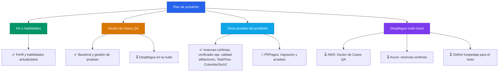

## 👨‍💻 Sobre mí

```javascript
const luisFelipe: Profesional = {
  nombre: "Luis Felipe Arias",
  rol: "Ingeniero de Sistemas · QA & Automatización",
  enfoqueActual: [
    "🧪 Pruebas funcionales, diseño de casos y validación de servicios API REST",
    "🐍 Backends en Python (FastAPI) conectados a bases de datos",
    "☁️ Fundamentos de AWS Cloud aplicados a proyectos reales",
  ],
  formacionYCertificaciones: [
    "2026 · Software Testing and Automation (Coursera)",
    "2026 · Connecting MongoDB to Python (Mongo University)",
    "2025 · Ingeniería de Sistemas (Universidad EAN)",
    "2024 · AWS Academy Cloud Foundations (AWS Academy)",
    "2024 · Desarrollo Web Full Stack (Talento Tech Bogotá – MinTIC)",
    "2023 · Programación Web Desde Cero (EGGApp)",
    "2023 · Foundation: Introduction to SQL (Simplilearn)",
    "2023 · Aprende a Programar con Python (EANx)",
    "2023 · Testing (PROtalento)",
    "2023 · Análisis Exploratorio de Datos con Python (SENA)",
    "2019 · ITIL v4 Foundation (PeopleCert)",
  ],
  stack: {
    lenguajes: ["Python", "SQL", "PHP", "JavaScript"],
    basesDeDatos: ["MongoDB", "Azure SQL", "PostgreSQL", "MySQL"],
    testing: ["Postman", "Pruebas funcionales API REST", "Diseño de casos de prueba"],
    cloud: ["AWS Cloud Foundations"],
    metodologías: ["ITIL v4"],
  },
};

const filosofía = () => ({
  pruebas: "Cada funcionalidad se valida antes de entregarse",
  código: "Documentado y trazable",
  aprendizaje: "Constante, un curso terminado a la vez",
});
```

## 🚀 Proyectos

| Nombre | Descripción | Plataformas | URL |
|---|---|---|---|
| Gestor de Casos de Prueba QA | App web de gestión de casos de prueba (proyectos, suites, casos, ejecuciones, defectos, dashboard). |    | [Ver repo](https://github.com/lariasca1994/gestor-casos-qa) |
| reservas-corferias | Reserva de escenarios de un centro de convenciones: catálogo, agenda, reservas y panel administrativo. |    | [Ver repo](https://github.com/lariasca1994/reservas-corferias) |
| verificador-api | Validación de endpoints de servicios API REST y pruebas automatizadas de respuesta. |    | [Ver repo](https://github.com/lariasca1994/verificador-api) |
| calidad-afiliaciones | Tablero y scripts de control de calidad y validación de reglas de negocio en procesos de afiliaciones. |    | [Ver repo](https://github.com/lariasca1994/calidad-afiliaciones) |
| TaskFlow | Gestor de tareas con módulo de analítica de archivos con pandas y procesamiento en tiempo real. |    | [Ver repo](https://github.com/lariasca1994/taskflow) |
| ColombiaTech2 | Plataforma de alquiler de vivienda con comunicación en tiempo real y arquitectura desacoplada. |    | [Ver repo](https://github.com/lariasca1994/ColombiaTech2) |
| PRPagos | Simulación y validación de flujos de pagos y reglas transaccionales. |   | [Ver repo](https://github.com/lariasca1994/PRPagos) |
| job-search-automation | Automatización y extracción estructurada de ofertas de empleo mediante web scraping. |   | [Ver repo](https://github.com/lariasca1994/job-search-automation) |
| PWDC | Ejercicios y fundamentos de desarrollo web del programa Programación Web Desde Cero. |    | [Ver repo](https://github.com/lariasca1994/PWDC) |

## 💡 Hoja de ruta



## 📫 Contacto

[](mailto:ariascluisf@gmail.com)
[](https://wa.me/573212563992)
[](https://t.me/LFAC6)
[](https://www.linkedin.com/in/luisfelipeariascarriazo)
[](https://github.com/lariasca1994)

🔗 Portafolio: [https://acortar.link/gA2DbE](https://acortar.link/gA2DbE)[cite: 1]

- **💬 WhatsApp:** @carraian160
- **✈️ Telegram:** @LFAC6

---


**Última actualización:** Septiembre 2026
