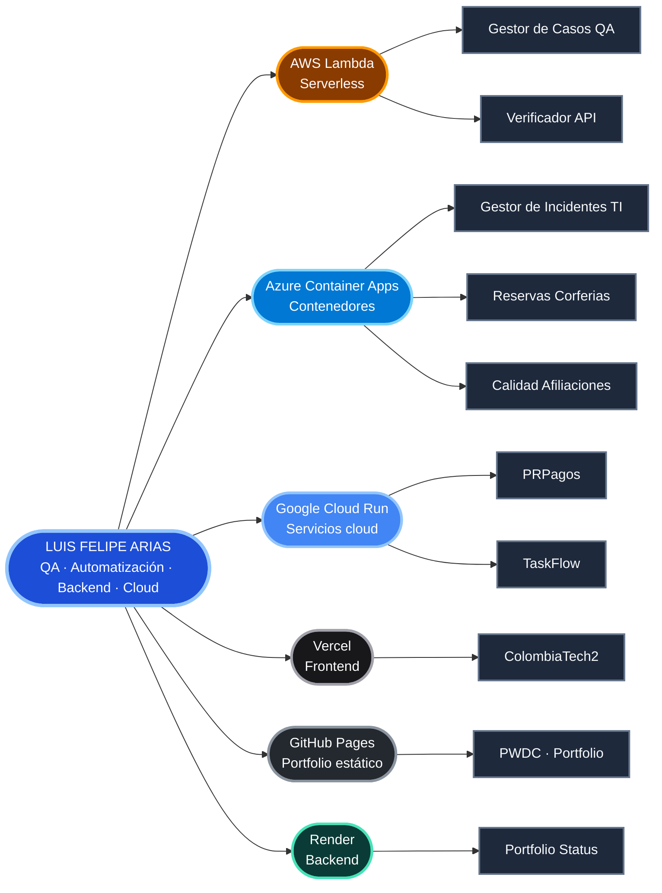

## 👨‍💻 Sobre mí

```javascript
const luisFelipe = {
  nombre: "Luis Felipe Arias",
  rol: "Ingeniero de Sistemas · QA & Automatización",
  enfoqueActual: [
    "🧪 Pruebas funcionales, diseño de casos y validación de servicios API REST",
    "🐍 Backends en Python (FastAPI) conectados a bases de datos",
    "☁️ Fundamentos de AWS Cloud aplicados a proyectos reales",
  ],
  formacionYCertificaciones: [
    "2026 · Software Testing and Automation (Coursera)",
    "2026 · Connecting MongoDB to Python (Mongo University)",
    "2025 · Ingeniería de Sistemas (Universidad EAN)",
    "2024 · AWS Academy Cloud Foundations (AWS Academy)",
    "2024 · Desarrollo Web Full Stack (Talento Tech Bogotá – MinTIC)",
    "2023 · Programación Web Desde Cero (EGGApp)",
    "2023 · Foundation: Introduction to SQL (Simplilearn)",
    "2023 · Aprende a Programar con Python (EANx)",
    "2023 · Testing (PROtalento)",
    "2023 · Análisis Exploratorio de Datos con Python (SENA)",
    "2019 · ITIL v4 Foundation (PeopleCert)",
  ],
  stack: {
    lenguajes: ["Python", "SQL", "PHP", "JavaScript", "C#"],
    basesDeDatos: [
      "MongoDB",
      "Azure SQL",
      "PostgreSQL",
      "MySQL",
      "Oracle Database",
    ],
    testing: [
      "Postman",
      "Pruebas funcionales de API REST",
      "Diseño de casos de prueba",
    ],
    cloud: [
      "AWS Lambda",
      "Azure Container Apps",
      "Google Cloud Run",
      "Vercel",
      "GitHub Pages",
    ],
    metodologias: ["ITIL v4"],
  },
};

const filosofia = () => ({
  pruebas: "Cada funcionalidad se valida antes de entregarse",
  codigo: "Documentado y trazable",
  aprendizaje: "Constante, un curso terminado a la vez",
});
```

---

## 🟢 Estado en vivo de mis proyectos

[](https://frontend-nine-topaz-99.vercel.app)
[](https://frontend-nine-topaz-99.vercel.app)

Todos los proyectos de este portafolio se monitorean en tiempo real: disponibilidad, tiempo de respuesta y % de uptime de los últimos 7 días, con historial guardado en Oracle Autonomous Database.

---

## ☁️ Ecosistema de despliegue

> Aplicaciones, APIs y proyectos de automatización desplegados en plataformas cloud.



<sub>
🟧 AWS Lambda · 🔷 Azure Container Apps · 🔵 Google Cloud Run · ▲ Vercel · ◉ GitHub Pages · 🟢 Render
</sub>

---

## 🚀 Proyectos destacados

> Los 10 proyectos de mi portafolio, con su motor de base de datos identificado por color: 🔴 Oracle · 🟢 MongoDB · 🔵 PostgreSQL · 🔷 Azure SQL · 🟠 MySQL / estático.

<table>
<tr>
<td width="50%">

**🟢 [ColombiaTech2](https://github.com/lariasca1994/ColombiaTech2)**

Plataforma de alquiler de vivienda con mensajería en tiempo real entre arrendadores e inquilinos. Backend unificado en REST, GraphQL y WebSockets.

  

☁️ Vercel · [🔗 Demo](https://colombia-tech2.vercel.app/)

</td>
<td width="50%">

**🟢 [Gestor de Casos de Prueba QA](https://github.com/lariasca1994/gestor-casos-qa)**

Plataforma end-to-end para gestionar proyectos, suites, casos de prueba, ejecuciones, defectos y métricas de calidad.

  

☁️ AWS Lambda · [🔗 Demo](https://immxew65sfxj7nubwzlszdimfi0qegzc.lambda-url.us-east-1.on.aws/)

</td>
</tr>
<tr>
<td width="50%">

**🔷 [Gestor de Incidentes TI](https://github.com/lariasca1994/GestorIncidentesTI)**

Mini ITSM para soporte de aplicaciones: priorización, SLA, escalamiento automático N1 → N2 → N3 y trazabilidad de incidentes.

  

☁️ Azure Container Apps · [🔗 Demo](https://gestorincidentesti.livelywater-fe29fe0b.australiaeast.azurecontainerapps.io/)

</td>
<td width="50%">

**🔴 [PRPagos](https://github.com/lariasca1994/PRPagos)**

Simulador de flujos de pago y validación de reglas transaccionales, con app de escritorio y backend web independiente.

  

☁️ Google Cloud Run · [🔗 Demo](https://prpagos-web-1087929107584.southamerica-east1.run.app)

</td>
</tr>
<tr>
<td width="50%">

**🔷 [reservas-corferias](https://github.com/lariasca1994/reservas-corferias)**

Sistema de reservas para un centro de convenciones: catálogo de escenarios, calendario de disponibilidad y panel administrativo.

  

☁️ Azure Container Apps · [🔗 Demo](https://reservas-corferias.blueocean-86680030.eastus.azurecontainerapps.io/)

</td>
<td width="50%">

**🟠 [calidad-afiliaciones](https://github.com/lariasca1994/calidad-afiliaciones)**

Motor de control de calidad para procesos de afiliación: validación de reglas de negocio y seguimiento de inconsistencias.

  

☁️ Azure Container Apps · [🔗 Demo](https://calidad-afiliaciones.blueocean-86680030.eastus.azurecontainerapps.io/)

</td>
</tr>
<tr>
<td width="50%">

**🟢 [TaskFlow](https://github.com/lariasca1994/taskflow)**

Gestor de tareas con carga de archivos, procesamiento con pandas y generación de reportes y analítica en tiempo real.

  

☁️ Google Cloud Run · [🔗 Demo](https://taskflow-812302804238.us-central1.run.app/)

</td>
<td width="50%">

**🔵 [verificador-api](https://github.com/lariasca1994/verificador-api)**

Suite de validación automatizada para endpoints REST: pruebas de contrato, códigos de estado y tiempos de respuesta.

  

☁️ AWS Lambda · [🔗 Demo](https://eofvlnitsiuodup4eywdcenxwu0adgbz.lambda-url.us-east-1.on.aws/)

</td>
</tr>
<tr>
<td width="50%">

**🟠 [PWDC](https://github.com/lariasca1994/PWDC)**

Sitio de portafolio personal construido sin frameworks, con HTML, CSS y JavaScript puro.

  

☁️ GitHub Pages · [🔗 Demo](https://lariasca1994.github.io/PWDC/)

</td>
<td width="50%">

**🔴 [Portfolio Status](https://github.com/lariasca1994/portafolio-status)**

Dashboard de observabilidad que monitorea en tiempo real la disponibilidad y el tiempo de respuesta de los 8 proyectos desplegados de este portafolio.

   

☁️ Render + Vercel · [🔗 Demo](https://frontend-nine-topaz-99.vercel.app)

</td>
</tr>
</table>

---

## 📫 Contacto

[](mailto:ariascluisf@gmail.com)
[](https://wa.me/carraian160)
[](https://t.me/lfac6)
[](https://www.linkedin.com/in/lfac1)
[](https://github.com/lariasca1994)

---


**Última actualización:** Septiembre de 2026