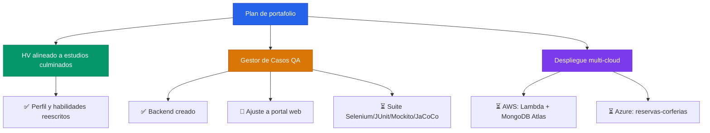

## 👨‍💻 Sobre mí

```javascript
const luisFelipe: Profesional = {
  nombre: "Luis Felipe Arias",
  rol: "Ingeniero de Sistemas · QA & Automatización",

  enfoqueActual: [
    "🧪 Pruebas funcionales y diseño de casos de prueba",
    "🐍 Backend en Python conectado a MongoDB",
    "☁️ Fundamentos de AWS Cloud aplicados a proyectos reales",
  ],

  enFormación: [
    "SQL (Netzum)",
    "Google Data Analytics Certificate",
  ],

  stack: {
    lenguajes: ["Python", "SQL", "Java"],
    basesDeDatos: ["MongoDB", "MySQL", "PostgreSQL"],
    testing: ["JUnit", "Mockito", "JaCoCo", "Selenium"],
    cloud: ["AWS Cloud Foundations"],
    metodologías: ["ITIL v4"],
  },
};

const filosofía = () => ({
  pruebas: "Cada funcionalidad se valida antes de entregarse",
  código: "Documentado y trazable",
  aprendizaje: "Constante, un curso terminado a la vez",
});
```

## 🚀 Proyecto destacado

<table>
  <tr>
    <td width="100%" valign="top">

### 🧪 Gestor de Casos de Prueba QA

**Backend Python + MongoDB para documentación y gestión de casos de prueba**

Proyecto ya creado; en ajuste para funcionar como portal web completo.

**Stack:**
<br>


🔗 Repositorio: _(agregar enlace)_
🔗 Demo / portal desplegado: _(pendiente — en ajuste)_

</td>
  </tr>
</table>

## 🔨 En ajuste

<table>
<tr><td>

**Portales web en construcción**
- reservas-corferias (Laravel) — completando flujo funcional
- Suite de automatización QA (Selenium + JUnit + Mockito + JaCoCo)

</td></tr>
</table>

## 📌 Otros proyectos

### 🎯 ColombiaTech
Proyecto del BootCamp ColombiaTech.
🔗 Repositorio: https://github.com/lariasca1994/ColombiaTech
🔗 Desplegado: https://colombia-tech-toyd.vercel.app
`JavaScript` `HTML` `CSS`

### 🎓 Desarrollo-de-Software
Ejercicios y guías del curso de Desarrollo de Software — Universidad EAN.
🔗 Repositorio: https://github.com/lariasca1994/Desarrollo-de-Software

## 💡 Hoja de ruta



## 📫 Contacto

[](mailto:ariascluisf@gmail.com)
[](https://wa.me/carraian159)
[](https://t.me/lfac6)
[](https://www.linkedin.com/in/luisfelipeariascarriazo)
[](https://github.com/lariasca1994)
🔗 Portafolio: _(agregar enlace cuando esté listo)_

- **💬 WhatsApp:** @carraian159
- **✈️ Telegram:** @lfac6

---


**Última actualización:** Septiembre 2026
