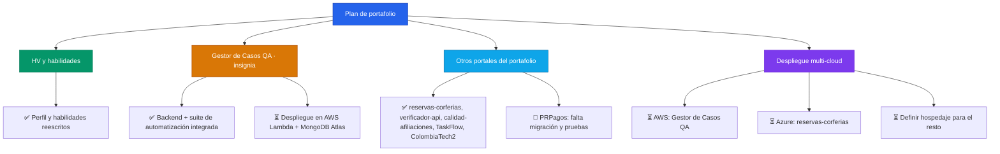

## 👨‍💻 Sobre mí

```javascript
const luisFelipe: Profesional = {
  nombre: "Luis Felipe Arias",
  rol: "Ingeniero de Sistemas · QA & Automatización",
  enfoqueActual: [
    "🧪 Pruebas funcionales, diseño de casos y automatización (JUnit, Mockito, JaCoCo, Cucumber, pitest)",
    "🐍 Backends en Python (FastAPI) conectados a MongoDB, PostgreSQL y MySQL",
    "☁️ Fundamentos de AWS Cloud aplicados a proyectos reales",
  ],
  enFormación: [
    "SQL (Netzum)",
    "Google Data Analytics Certificate",
  ],
  stack: {
    lenguajes: ["Python", "SQL", "Java", "PHP"],
    basesDeDatos: ["MongoDB", "MySQL", "PostgreSQL", "SQL Server", "Oracle"],
    testing: ["JUnit", "Mockito", "JaCoCo", "Cucumber", "pitest", "PHPUnit"],
    cloud: ["AWS Cloud Foundations", "Neon", "Aiven", "MongoDB Atlas"],
    metodologías: ["ITIL v4"],
  },
};

const filosofía = () => ({
  pruebas: "Cada funcionalidad se valida antes de entregarse",
  código: "Documentado y trazable",
  aprendizaje: "Constante, un curso terminado a la vez",
});
```

## 🚀 Proyecto destacado

<table>
  <tr>
    <td width="100%" valign="top">

### 🧪 Gestor de Casos de Prueba QA

**Backend Python + MongoDB para documentación y gestión de casos de prueba, con su propia suite de automatización integrada**

Organiza proyectos, suites y casos de prueba, registra ejecuciones con su resultado, vincula defectos y mide cobertura — con roles QA/ADMIN. La suite de automatización (JUnit, Mockito, JaCoCo, Cucumber y mutation testing con pitest, sobre el ejercicio CoffeeMaker de Coursera) vive en el mismo repositorio y alimenta las ejecuciones que se registran ahí.

**Stack:**
<br>


🔗 Repositorio: https://github.com/lariasca1994/gestor-casos-qa
🔗 Demo / portal desplegado: _(pendiente — despliegue planeado en AWS Lambda + MongoDB Atlas)_

</td>
  </tr>
</table>

## 🔨 Portales en ajuste (funcionales, pendientes de despliegue)

<table>
<tr><td>

- **reservas-corferias** — Laravel 12 + Azure SQL. Catálogo de escenarios, agenda, reservas con QR, cuenta de cliente y panel administrativo con métricas. Pruebas con PHPUnit y CI en GitHub Actions.
  `PHP` `Laravel` `Azure SQL` — https://github.com/lariasca1994/reservas-corferias

- **verificador-api** — FastAPI + PostgreSQL (Neon). Colecciones de pruebas de API con ejecución con un clic, historial de resultados y rol admin de solo lectura.
  `Python` `FastAPI` `PostgreSQL` — https://github.com/lariasca1994/verificador-api

- **calidad-afiliaciones** — FastAPI + MySQL (Aiven). Tablero de calidad y homologación de datos de afiliaciones multicanal, con exportación a CSV.
  `Python` `FastAPI` `MySQL` — https://github.com/lariasca1994/calidad-afiliaciones

- **TaskFlow** — FastAPI + MongoDB + HTMX. Gestor de tareas personales con módulo de analítica (pandas) sobre archivos propios y de ejemplo.
  `Python` `FastAPI` `MongoDB` `pandas` — https://github.com/lariasca1994/taskflow

- **ColombiaTech2** — NestJS (REST + GraphQL + WebSockets) + React + MongoDB. Plataforma de alquiler de vivienda con chat en tiempo real.
  `NestJS` `React` `MongoDB` `GraphQL` — https://github.com/lariasca1994/ColombiaTech2

- **PRPagos** — Spring Boot + Oracle Autonomous Database. Gestión de pagos personales con rol admin de solo lectura; falta correr la migración de base de datos y las pruebas finales.
  `Java` `Spring Boot` `Oracle` — _(repositorio pendiente de confirmar/renombrar)_

</td></tr>
</table>

## 💡 Hoja de ruta



## 📫 Contacto

[](mailto:ariascluisf@gmail.com)
[](https://wa.me/carraian159)
[](https://t.me/lfac6)
[](https://www.linkedin.com/in/luisfelipeariascarriazo)
[](https://github.com/lariasca1994)

🔗 Portafolio: _(agregar enlace cuando PWDC esté listo)_

- **💬 WhatsApp:** @carraian159
- **✈️ Telegram:** @lfac6

---


**Última actualización:** Septiembre 2026
