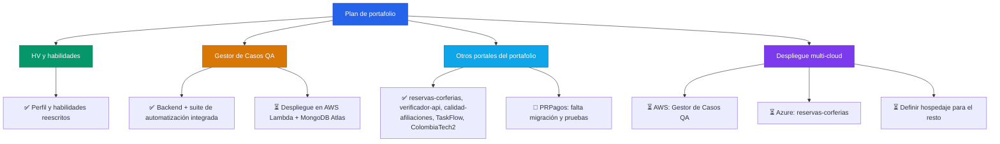

## 👨‍💻 Sobre mí

```javascript
const luisFelipe: Profesional = {
  nombre: "Luis Felipe Arias",
  rol: "Ingeniero de Sistemas · QA & Automatización",
  enfoqueActual: [
    "🧪 Pruebas funcionales, diseño de casos y automatización (JUnit, Mockito, JaCoCo, Cucumber, pitest)",
    "🐍 Backends en Python (FastAPI) conectados a MongoDB, PostgreSQL y MySQL",
    "☁️ Fundamentos de AWS Cloud aplicados a proyectos reales",
  ],
  enFormación: [
    "SQL (Netzum)",
    "Google Data Analytics Certificate",
  ],
  stack: {
    lenguajes: ["Python", "SQL", "Java", "PHP"],
    basesDeDatos: ["MongoDB", "MySQL", "PostgreSQL", "SQL Server", "Oracle"],
    testing: ["JUnit", "Mockito", "JaCoCo", "Cucumber", "pitest", "PHPUnit"],
    cloud: ["AWS Cloud Foundations", "Neon", "Aiven", "MongoDB Atlas"],
    metodologías: ["ITIL v4"],
  },
};

const filosofía = () => ({
  pruebas: "Cada funcionalidad se valida antes de entregarse",
  código: "Documentado y trazable",
  aprendizaje: "Constante, un curso terminado a la vez",
});
```

## 🚀 Proyectos

| Nombre | Descripción | Plataformas | URL |
|---|---|---|---|
| Gestor de Casos de Prueba QA | App web de gestión de casos de prueba (proyectos, suites, casos, ejecuciones, defectos, dashboard), con su suite de automatización (JUnit, Mockito, JaCoCo, Cucumber, pitest) integrada en el mismo repositorio. | FastAPI (Python) · MongoDB Atlas · pensado para AWS Lambda + API Gateway | |
| reservas-corferias | Reserva de escenarios de un centro de convenciones: catálogo, agenda, reservas con QR y panel administrativo con métricas. | Laravel 12 (PHP) · Azure SQL · pensado para Azure App Service | |
| verificador-api | Automatización de pruebas de API (colecciones, ejecución con un clic, historial de resultados) — una versión propia de Postman/Newman. | FastAPI (Python) · PostgreSQL (Neon) | |
| calidad-afiliaciones | Consolidación y tablero de calidad/homologación de datos de afiliaciones multicanal, con exportación a CSV. | FastAPI (Python) · MySQL (Aiven) | |
| TaskFlow | Gestor de tareas personales con módulo de analítica de archivos (pandas) y actualización en tiempo real. | FastAPI (Python) · MongoDB | |
| ColombiaTech2 | Plataforma de alquiler de vivienda con chat en tiempo real, backend con REST + GraphQL + WebSockets. | NestJS + React · MongoDB · pensado para Render + Vercel | |
| PRPagos | Gestión de pagos personales, con rol admin de solo lectura sobre los pagos de todos los usuarios. | Spring Boot (Java) · Oracle Autonomous Database | |

## 💡 Hoja de ruta



## 📫 Contacto

[](mailto:ariascluisf@gmail.com)
[](https://wa.me/carraian159)
[](https://t.me/lfac6)
[](https://www.linkedin.com/in/luisfelipeariascarriazo)
[](https://github.com/lariasca1994)

🔗 Portafolio: _(agregar enlace cuando PWDC esté listo)_

- **💬 WhatsApp:** @carraian159
- **✈️ Telegram:** @lfac6

---


**Última actualización:** Septiembre 2026
