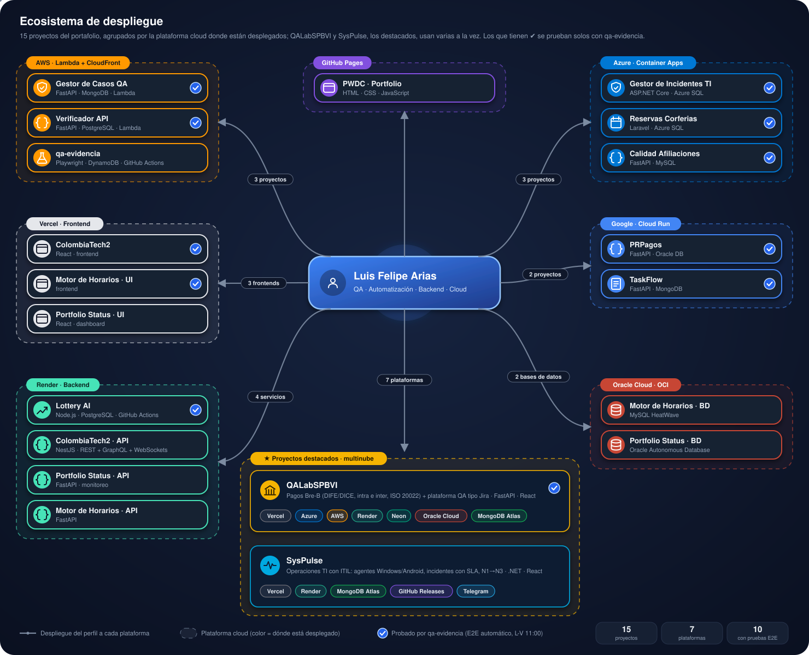

 

```typescript
const luisFelipe: Profesional = {
  nombre: "Luis Felipe Arias",
  rol: "Ingeniero de Sistemas · QA & Automatización",
  enfoqueActual: [
    "🧪 Pruebas funcionales, diseño de casos y validación de servicios API REST",
    "🐍 Backends en Python (FastAPI) conectados a bases de datos",
    "☁️ Fundamentos de AWS Cloud aplicados a proyectos reales",
  ],
  formacionAcademica: [
    "Nov 2025 · Ingeniería de Sistemas (Universidad EAN)",
  ],
  certificaciones: [
    "2026 · Software Testing and Automation (Coursera)",
    "2026 · Connecting MongoDB to Python (Mongo University)",
    "2024 · AWS Academy Cloud Foundations (AWS Academy)",
    "2024 · Desarrollo Web Full Stack (Talento Tech Bogotá – MinTIC)",
    "2023 · Programación Web Desde Cero (EGGApp)",
    "2023 · Foundation: Introduction to SQL (Simplilearn)",
    "2023 · Aprende a Programar con Python (EANx)",
    "2023 · Testing (PROtalento)",
    "2023 · Análisis Exploratorio de Datos con Python (SENA)",
    "2019 · ITIL v4 Foundation (PeopleCert)",
  ],
  stack: {
    lenguajes: ["Python", "SQL", "PHP", "JavaScript", "TypeScript", "Java", "C#"],
    basesDeDatos: ["MongoDB", "Azure SQL", "PostgreSQL", "MySQL", "Oracle DB", "DynamoDB"],
    testing: ["Postman", "Playwright (E2E)", "Pruebas funcionales API REST", "Diseño de casos de prueba"],
    cloud: ["AWS", "Azure", "Google Cloud", "Oracle Cloud (OCI)", "Vercel", "Render"],
    metodologías: ["ITIL v4"],
  },
};

const filosofía = () => ({
  pruebas: "Cada funcionalidad se valida antes de entregarse",
  código: "Documentado y trazable",
  aprendizaje: "Constante, un curso terminado a la vez",
});
```

---

## 🟢 Estado en vivo de mis proyectos

<p>
  <a href="https://frontend-nine-topaz-99.vercel.app"></a><br>
  <a href="https://frontend-nine-topaz-99.vercel.app"></a><br>
  <a href="https://d4i3vsgw7xwmh.cloudfront.net"></a>
</p>

Todos los proyectos de este portafolio se monitorean en tiempo real: disponibilidad, tiempo de respuesta y % de uptime de los últimos 7 días, con historial guardado en Oracle Autonomous Database. Además, el proyecto qa-evidencia corre pruebas end-to-end automatizadas de lunes a viernes, dos veces al día (11:00 y 17:00), sobre 10 de estos proyectos y publica ahí mismo la fecha de la última corrida junto con la evidencia (capturas) de cada uno.

---

## ☁️ Ecosistema de despliegue

> Aplicaciones, APIs y proyectos de automatización desplegados en plataformas cloud.

<p align="center">
  
</p>

<sub>
Cada proyecto tiene el color de la plataforma donde está desplegado: 🟧 AWS · 🔷 Azure Container Apps · 🔵 Google Cloud Run · 🔴 Oracle Cloud (OCI) · 🟢 Render · ⚫ Vercel · 🟣 GitHub Pages. Los que tienen ✔ se prueban automáticamente con qa-evidencia.
</sub>

---

## ⭐ Proyecto destacado

<table>
<tr>
<td>

### 🏦 [QALabSPBVI](https://github.com/lariasca1994/QALabSPBVI) — Laboratorio de pagos inmediatos y plataforma QA

Proyecto que reúne lo que trabajo en el resto del portafolio. Simula pagos inmediatos inspirados en Bre-B (llaves, pagos intra e inter-SPBVI, ISO 20022). Incluye una plataforma QA tipo Jira con casos REST/JSON ejecutables, desplegada en siete plataformas cloud, todas en capa gratuita.

       

☁️ Vercel · Azure · AWS · Render · Neon · Oracle Cloud · MongoDB Atlas · [🔗 Demo](https://qalabspbvi.vercel.app) · [📖 Arquitectura y detalle](https://github.com/lariasca1994/QALabSPBVI#arquitectura)

</td>
</tr>
</table>

---

## 🚀 Proyectos destacados

> Los 13 proyectos de mi portafolio, agrupados por área y, dentro de cada grupo, de mayor a menor complejidad, con su motor de base de datos identificado por color: 🔴 Oracle · 🟢 MongoDB · 🔵 PostgreSQL · 🔷 Azure SQL · 🟠 MySQL / estático · 🟣 DynamoDB.

### 🧪 QA y automatización de pruebas

<sub>Pruebas E2E automatizadas, gestión de casos de prueba y validación de APIs.</sub>

<table>
<tr>
<td width="50%">

**🟣 [qa-evidencia](https://github.com/lariasca1994/qa-evidencia)**

Suite de pruebas E2E automatizada que corre de lunes a viernes, dos veces al día (11:00 y 17:00), contra 10 proyectos desplegados de este portafolio (login fallido y flujo positivo), sube la evidencia (capturas) a Cloudinary y los resultados a DynamoDB, y envía un correo de resumen — con panel de evidencia en vivo. Se despliega sola en cada push con GitHub Actions (OIDC, sin llaves de AWS) y limpia cada semana la evidencia de más de 15 días.

   

☁️ AWS CodeBuild + CloudFront · [🔗 Ver panel](https://d4i3vsgw7xwmh.cloudfront.net)

</td>
<td width="50%">

**🟢 [Gestor de Casos de Prueba QA](https://github.com/lariasca1994/gestor-casos-qa)**

Plataforma end-to-end para gestionar proyectos, suites, casos de prueba, ejecuciones, defectos y métricas de calidad.

  

☁️ AWS Lambda · [🔗 Demo](https://immxew65sfxj7nubwzlszdimfi0qegzc.lambda-url.us-east-1.on.aws/)

</td>
</tr>
<tr>
<td width="50%">

**🔵 [verificador-api](https://github.com/lariasca1994/verificador-api)**

Suite de validación automatizada para endpoints REST: pruebas de contrato, códigos de estado y tiempos de respuesta.

  

☁️ AWS Lambda · [🔗 Demo](https://eofvlnitsiuodup4eywdcenxwu0adgbz.lambda-url.us-east-1.on.aws/)

</td>
</tr>
</table>

### 💻 Desarrollo de software

<sub>Aplicaciones web y de escritorio de punta a punta: backend, frontend, autenticación y despliegue.</sub>

<table>
<tr>
<td width="50%">

**🟠 [Motor de Horarios](https://github.com/lariasca1994/motor-horarios-oci)**

Coordina reuniones entre varias personas: cada usuario registra su disponibilidad (con recurrencia RRULE) y sus reglas de horario; el motor propone los 3 mejores huecos comunes y avisa por correo a los participantes. Incluye autenticación y roles.

   

☁️ Vercel + Render + OCI · [🔗 Demo](https://motor-horarios-oci.vercel.app)

</td>
<td width="50%">

**🟢 [ColombiaTech2](https://github.com/lariasca1994/ColombiaTech2)**

Plataforma de alquiler de vivienda con mensajería en tiempo real entre arrendadores e inquilinos. Backend unificado en REST, GraphQL y WebSockets.

  

☁️ Vercel + Render · [🔗 Demo](https://colombia-tech2.vercel.app/)

</td>
</tr>
<tr>
<td width="50%">

**🔴 [PRPagos](https://github.com/lariasca1994/PRPagos)**

Simulador de flujos de pago y validación de reglas transaccionales, disponible en dos versiones dentro del mismo repositorio: aplicación de escritorio en Java Swing y aplicación web con FastAPI (Python).

  

☁️ Google Cloud Run · [🔗 Demo web](https://prpagos-web-1087929107584.southamerica-east1.run.app)

</td>
<td width="50%">

**🔷 [reservas-corferias](https://github.com/lariasca1994/reservas-corferias)**

Sistema de reservas para un centro de convenciones: catálogo de escenarios, calendario de disponibilidad y panel administrativo.

  

☁️ Azure Container Apps · [🔗 Demo](https://reservas-corferias.blueocean-86680030.eastus.azurecontainerapps.io/)

</td>
</tr>
<tr>
<td width="50%">

**🟢 [TaskFlow](https://github.com/lariasca1994/taskflow)**

Gestor de tareas con carga de archivos, procesamiento con pandas y generación de reportes y analítica en tiempo real.

  

☁️ Google Cloud Run · [🔗 Demo](https://taskflow-812302804238.us-central1.run.app/)

</td>
<td width="50%">

**🟠 [PWDC](https://github.com/lariasca1994/PWDC)**

Sitio de portafolio personal construido sin frameworks, con HTML, CSS y JavaScript puro.

  

☁️ GitHub Pages · [🔗 Demo](https://lariasca1994.github.io/PWDC/)

</td>
</tr>
</table>

### 📊 Datos y analítica

<sub>Recolección, validación y análisis de datos con modelos y reglas de negocio.</sub>

<table>
<tr>
<td width="50%">

**🔵 [Lottery AI](https://lottery-ai-oa2p.onrender.com)**

Análisis y modelos predictivos de las loterías colombianas (Baloto, Revancha, MiLoto y ColorLOTO). Recolecta resultados y premios, demuestra con backtesting *walk-forward* que los números no se pueden predecir y predice lo que sí: venta estimada, probabilidad de ganador del premio mayor y valor esperado del boleto. Envía un resumen diario por correo.

   

☁️ Render + GitHub Actions · [🔗 Demo](https://lottery-ai-oa2p.onrender.com)

</td>
<td width="50%">

**🟠 [calidad-afiliaciones](https://github.com/lariasca1994/calidad-afiliaciones)**

Motor de control de calidad para procesos de afiliación: validación de reglas de negocio y seguimiento de inconsistencias.

  

☁️ Azure Container Apps · [🔗 Demo](https://calidad-afiliaciones.blueocean-86680030.eastus.azurecontainerapps.io/)

</td>
</tr>
</table>

### 🛠️ Operaciones y soporte TI

<sub>Observabilidad de servicios y gestión de incidentes con SLA y escalamiento.</sub>

<table>
<tr>
<td width="50%">

**🔴 [Portfolio Status](https://github.com/lariasca1994/portafolio-status)**

Dashboard de observabilidad que monitorea en tiempo real la disponibilidad y el tiempo de respuesta de los 9 proyectos desplegados de este portafolio.

   

☁️ Render + Vercel · [🔗 Demo](https://frontend-nine-topaz-99.vercel.app)

</td>
<td width="50%">

**🔷 [Gestor de Incidentes TI](https://github.com/lariasca1994/GestorIncidentesTI)**

Mini ITSM para soporte de aplicaciones: priorización, SLA, escalamiento automático N1 → N2 → N3 y trazabilidad de incidentes.

  

☁️ Azure Container Apps · [🔗 Demo](https://gestorincidentesti.livelywater-fe29fe0b.australiaeast.azurecontainerapps.io/)

</td>
</tr>
</table>

---

## 📫 Contacto

<a href="mailto:ariascluisf@hotmail.com"></a>
<a href="https://wa.me/cortosvar26"></a>
<a href="https://t.me/lfac6"></a>
<a href="https://www.linkedin.com/in/lfac1"></a>
<a href="https://github.com/lariasca1994"></a>

---


**Última actualización:** Septiembre de 2026